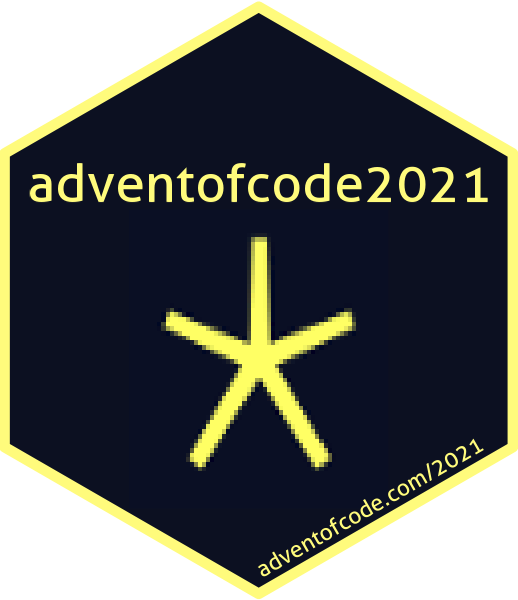

<!-- README.md is generated from README.Rmd. Please edit that file -->

```{r, include = FALSE}
knitr::opts_chunk$set(
  collapse = TRUE,
  comment = "#>"
)
```

# adventofcode2021 <a href='https://adventofcode.com/2021'></a>

<!-- badges: start -->
<!-- badges: end -->

Solutions of <a href="https://adventofcode.com/2021" target="_blank">Advent of Code 2021</a> with R.


